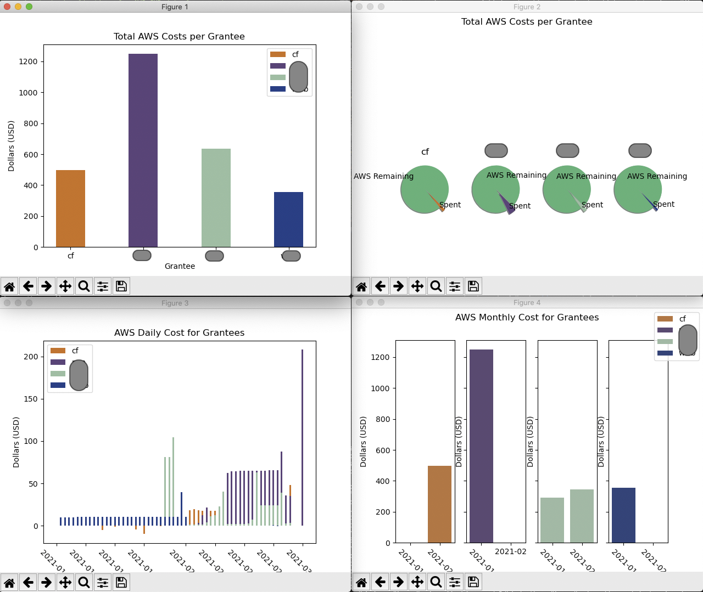

# Processing AWS Cost & Usage Reporting (CUR)

The purpose of this tool is to be able to download multiple AWS CUR's from different AWS accounts and run some basic analytics on the current total AWS costs, monthly costs, daily costs, etc.

This was developed for Cloudera Foundation (CF) to help assess AWS CUR costs to ensure that grants provided to NGO's stay within/under the AWS budget for each project.

The tool goes out to an S3 bucket for each grantee (separate AWS accounts) and pulls the latest JSON manifest file, which directs us to the latest CSV file produced for each month. The latest CSV file is then downloaded, loaded into a dictionary of dataframes (one DF for each grantee). NOTE: This will eventually be moved into a multi-index dataframe. We then run some simple aggregations and produce various visualizations to help provide insight into the cost and usage for each AWS account.

## Configuration Files
There are 2 configuration files you need to modify:

- config.ini: This is used as the main configuration file for running this program. You can set the following items:

    - Location of the 2nd configuration file, that has details about each of the AWS accounts. In the case of CF, this is grantees file
    - Directory where AWS CUR files are downloaded
    - Logging level

- grantees.ini: This can be named anything, as long as it's referenced accordingly in config.ini. This is the file that has all the details about each of the AWS accounts. The following items can be set:

    - Full grantee name and shortname
    - The S3 bucket and S3 prefix (folder, as defined in AWS CUR settings). NOTE: See details on how to properly setup the AWS CUR here
    - AWS CUR report name
    - AWS grant amount or the amount that defines your total cost threshold
    - Color for each grantee (for charting/visualization purposes)

## Setting Up AWS CUR
You can checkout the following <a href="">blog</a> to get information on how to properly setup AWS CUR to work with this tool

## Running Tool
Running this tool, aws_cur_analytics.py (without any command line options currently), will create sub-directories for each grantee (based on shortname, ie: "cf") and will produce the following charts (grantee org names masked):

